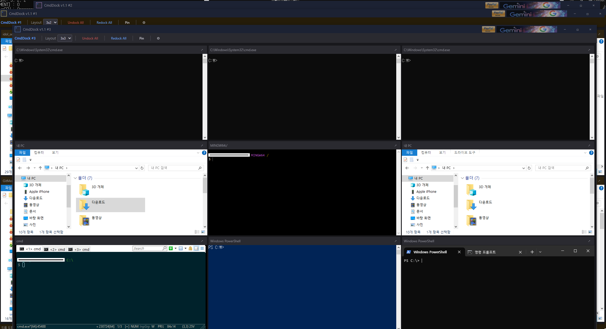

# CmdDock

**CmdDock** is a lightweight Windows desktop utility that docks multiple **CMD**, **PowerShell**, **Windows Terminal**, and **Explorer** windows into a single grid host. Lay out a row × column grid, drop any console or Explorer window into a cell, and manage them all from one window.

## Key Features

### Grid Docking
- **Row × Column layout** — arrange any number of rows and columns and drop windows into individual cells
- **Drag-to-dock** — drag a CMD, PowerShell, Terminal, or Explorer window over the host and drop it into a cell
- **Resizable cells** — drag row/column borders to resize cells; the host re-positions docked windows live
- **Undock / Redock** — return a docked window to free-floating, or re-dock a matching window from a saved session
- **Alt+Tab promotion** — undocked windows are promoted in the Alt+Tab MRU so they're one keystroke away

### Supported Window Types
- **cmd.exe** (Console Window)
- **powershell.exe**
- **Windows Terminal** (Cascadia hosting window)
- **ConEmu**
- **Git Bash** (mintty)
- **File Explorer** (Cabinet window)
- **Custom executables** — register any `.exe` / `.bat` / `.cmd` / `.lnk` to launch and dock as a cell

### Multi-Instance Sessions
- Run **up to 16 independent instances** of CmdDock side by side, each with its own grid and dock state
- Per-instance session file (`session-{N}.json`) saves grid dimensions, column/row ratios, window position, docked window metadata, Explorer paths, custom-exe registrations, and theme colors
- On restart, **Redock All** re-binds matching live windows back into their saved cells; nothing is auto-launched unless you ask for it

### Explorer Integration
- Launch Explorer directly into a cell at a saved path
- `/separate` launch — each docked Explorer runs in its own process so shell extension overlays (e.g. TortoiseGit) load cleanly without hitting Windows' 15-overlay-slot limit
- Saved per-cell paths so Redock returns to the exact folder

### Per-Cell Customization
- Editable **cell label** shown in the cell titlebar
- Per-cell **custom exe registration** so a single cell always launches/redocks your preferred tool
- Right-click menu per cell — Launch CMD / PowerShell / Explorer / Custom, Undock, Redock, Reset

### Custom Titlebar & Theme
- Self-drawn dark titlebar and toolbar (no system frame)
- User-tunable colors for **titlebar / toolbar / cell titlebar**, persisted with the session

## System Requirements

- **OS:** Windows 10 or later (x64)
- **Runtime:** Microsoft Edge **WebView2 Runtime** (pre-installed on Windows 11; auto-installed via Windows Update on Windows 10)
- **Installation:** Download the release ZIP, extract, and run `CmdDock.exe` — fully portable, no installer

## Usage

1. Run `CmdDock.exe` — the host window opens with an empty grid
2. Set the grid size (cols × rows) from the toolbar
3. Either:
   - **Drag** any existing CMD / PowerShell / Terminal / Explorer window over a cell and drop, or
   - **Right-click** a cell → Launch CMD / PowerShell / Explorer / Custom...
4. Drag the host titlebar to move the whole cluster; drag row/column borders to resize cells
5. State auto-saves to `session-{N}.json` next to `CmdDock.exe` and restores on next launch

## License

**CmdDock** is open-source software released under the **MIT License**.

See the [LICENSE](LICENSE) file for full details.

---

_Copyright (c) 2026 HappySloth._
